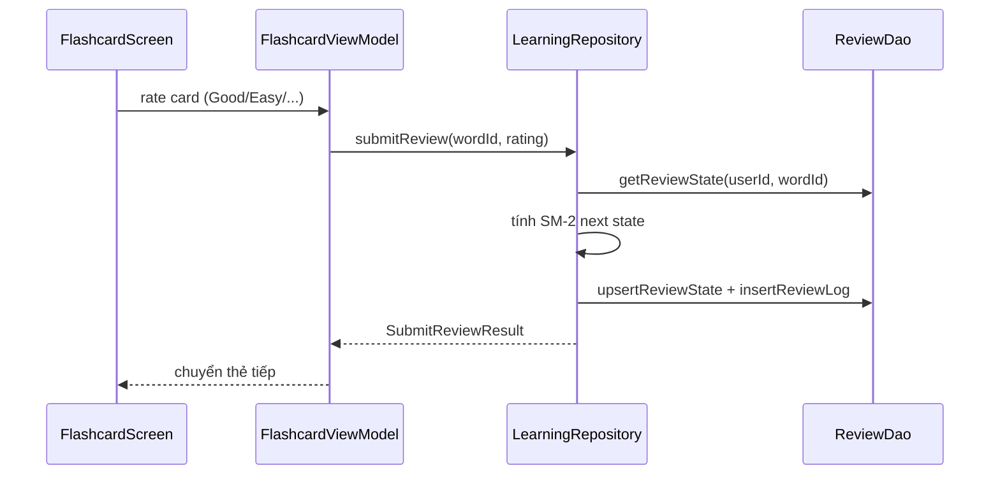

# MinLish — Learn English Vocabulary

Ứng dụng Android học từ vựng tiếng Anh bằng flashcard và spaced repetition. Chạy **hoàn toàn local** trên thiết bị — không cần server, Docker hay internet.

Mở project bằng **Android Studio** → chọn emulator/thiết bị → Run `app`.

---

## Mục lục

1. [Tính năng](#tính-năng)
2. [Kiến trúc tổng thể](#kiến-trúc-tổng-thể)
3. [Cấu trúc thư mục](#cấu-trúc-thư-mục)
4. [Ý nghĩa từng package](#ý-nghĩa-từng-package)
5. [Converter vs Mapper](#converter-vs-mapper)
6. [Database & tách dữ liệu theo user](#database--tách-dữ-liệu-theo-user)
7. [Seeding dữ liệu](#seeding-dữ-liệu)
8. [Repositories & UseCase](#repositories--usecase)
9. [Luồng dữ liệu mẫu](#luồng-dữ-liệu-mẫu)
10. [Navigation & Auth](#navigation--auth)
11. [Giới hạn v1 & Troubleshooting](#giới-hạn-v1--troubleshooting)

---

## Tính năng

- Đăng ký / đăng nhập theo email (local Room)
- 30 bộ từ seed từ Anki APKG (600 từ, có ảnh + audio)
- Tạo deck và quản lý từ vựng cá nhân
- Học flashcard với rating Again / Hard / Good / Easy (SM-2 đơn giản hóa)
- Dashboard tiến độ: streak, accuracy, từ đã học, từ đến hạn
- Nhắc học local qua WorkManager
- **Mỗi user có tiến độ riêng theo email** — catalog từ vựng seed dùng chung

**Tech stack:** Kotlin · Jetpack Compose · Material 3 · Room · Coroutines · WorkManager · MVVM

---

## Kiến trúc tổng thể

```
┌──────────────┐     collect      ┌──────────────┐
│  ui/screens  │ ◄─────────────── │  ViewModel   │
│  (Compose)   │   UiState        │  + UiState   │
└──────────────┘                  └──────┬───────┘
                                         │ gọi
                                  ┌──────▼───────┐
                                  │   UseCase    │  (2 cái — tùy màn)
                                  └──────┬───────┘
                                         │ AppResult<DomainModel>
                                  ┌──────▼───────┐
                                  │  Repository  │  ← Mapper Entity→Domain
                                  └──────┬───────┘
                                         │
                    ┌────────────────────┼────────────────────┐
             ┌──────▼──────┐    ┌────────▼────────┐   TypeConverter
             │     DAO     │    │     Entity      │   (Room: List<String>)
             └──────┬──────┘    └─────────────────┘
                    ▼
               SQLite (minlish.db)
```

**Nguyên tắc:**

- Một luồng: `UI → ViewModel → Repository → DAO → SQLite`
- Không Retrofit, không JWT, không DTO — dùng **Entity ↔ Domain Model** qua **Mapper**
- Manual DI qua `AppContainer` (không Hilt)
- Repository bọc kết quả trong `AppResult<T>` (Success / Failure)

### Các loại object — đừng nhầm

| Loại | Package | Vai trò |
|------|---------|---------|
| **UiState** | `presentation/viewmodel/` | State màn hình (loading, error, list…) — Compose đọc qua `StateFlow` |
| **Domain Model** | `domain/model/` | Dữ liệu sạch cho business/UI, có computed property |
| **Entity** | `data/local/entity/` | Một dòng bảng SQLite (`@Entity`) |
| **DAO** | `data/local/dao/` | Interface SQL — trả Entity hoặc POJO query |
| **Mapper** | `data/local/mapper/` | Entity → Domain (Repository gọi) |
| **TypeConverter** | `data/local/database/` | Kiểu Kotlin ↔ cột SQLite (Room tự gọi) |

---

## Cấu trúc thư mục

```
app/src/main/java/com/example/minlishapp_learnenglish/
├── core/                    # AppContainer, AppResult, audio, notification
├── data/
│   ├── local/
│   │   ├── entity/          # Room entities
│   │   ├── dao/             # Room DAOs
│   │   ├── database/        # MinLishDatabase, DatabaseSeeder, StringListConverter
│   │   └── mapper/          # LocalMappers.kt — Entity ↔ Domain
│   └── repository/          # Auth, Deck, Learning, Analytics, Notification
├── domain/
│   ├── model/               # User, VocabularyDeck, ReviewCard, ProgressStats…
│   └── usecase/             # LoadHomeUseCase, LoadProgressAnalyticsUseCase
├── presentation/viewmodel/  # ViewModel theo feature
├── navigation/              # Routes, AppNavGraph
└── ui/
    ├── screens/             # Màn hình Compose
    ├── components/          # Widget tái sử dụng
    └── theme/               # MinLishTheme

app/src/main/assets/
├── seed_vocabulary.json     # 30 unit, 600 từ
└── seed_media/              # Ảnh + audio flashcard

scripts/extract_apkg_to_seed_json.py
data/4000_Essential_English_Words_2_-_Vietnamese.apkg
```

### `AppContainer` — Dependency Injection

`MainActivity` tạo `AppContainer(applicationContext)` và truyền xuống navigation/ViewModel:

```
MinLishDatabase
├── userDao, deckDao, wordDao, reviewDao, notificationSettingsDao
├── authRepository, deckRepository, learningRepository
├── analyticsRepository, notificationRepository
├── reminderScheduler (WorkManager)
├── loadHomeUseCase, loadProgressAnalyticsUseCase
└── init → DatabaseSeeder.seedCatalogIfEmpty()
```

---

## Ý nghĩa từng package

### `ui/` — Giao diện

| Thư mục | Ý nghĩa |
|---------|---------|
| `screens/` | Màn hình full — chỉ nhận **UiState** + callback, **không** gọi Repository/DAO |
| `components/` | `DailyPlanCard`, `RemoteMediaImage`, bottom bar… |
| `theme/` | Màu, typography, spacing MinLish |

### `presentation/viewmodel/` — State màn hình

Mỗi feature một ViewModel. Trong cùng file thường có:

- **`XxxUiState`** — data class cho Compose
- **`XxxEvent`** — user action (search, click, rate card)
- **`XxxEffect`** — side effect một lần (navigate, snackbar)

ViewModel gọi Repository/UseCase → nhận `AppResult<T>` → map sang UiState.

### `domain/model/` — Model nghiệp vụ

Object sạch, không `@Entity`. Ví dụ `VocabularyDeck.learningProgress` tính từ `learnedCount/wordCount` — logic này không nằm trong Entity.

### `domain/usecase/` — Gộp nhiều repository

Chỉ còn 2 use case. Phần lớn ViewModel gọi Repository trực tiếp.

### `data/repository/` — Cổng dữ liệu duy nhất

| Repository | Nhiệm vụ |
|------------|----------|
| `AuthRepository` | Login/register/logout, getMe, updateMe |
| `DeckRepository` | CRUD deck & word, filter theo user |
| `LearningRepository` | Daily plan, flashcard queue, submitReview (SM-2) |
| `AnalyticsRepository` | Dashboard, activity 7 ngày, retention |
| `NotificationRepository` | Reminder settings theo user |
| `UserSession.kt` | `requireUserId()` — lấy user đang login |

Repository: gọi DAO → mapper → `AppResult`, chứa business logic (SM-2, validate, kiểm tra quyền deck).

### `data/local/entity/` — Bảng SQLite

| Entity | Bảng | Ghi chú |
|--------|------|---------|
| `UserEntity` | `users` | Password plaintext (demo) — không đưa hết sang Domain |
| `DeckEntity` | `decks` | `userId = null` → seed chung |
| `VocabularyWordEntity` | `vocabulary_words` | FK → decks |
| `ReviewStateEntity` | `review_states` | PK `(userId, wordId)` |
| `ReviewLogEntity` | `review_logs` | Lịch sử ôn |
| `NotificationSettingsEntity` | `notification_settings` | PK `userId` |

Entity **không** leak lên UI.

### `data/local/dao/` — SQL

```kotlin
@Query("SELECT * FROM decks WHERE userId IS NULL OR userId = :userId")
suspend fun getDecks(userId: Long): List<DeckEntity>
```

Trả **Entity** hoặc **POJO query** (ví dụ `DailyReviewCount` từ `GROUP BY`). Không trả Domain — Repository sẽ map.

### `data/local/database/`

| File | Vai trò |
|------|---------|
| `MinLishDatabase.kt` | DB version 2, `fallbackToDestructiveMigration()` |
| `StringListConverter.kt` | `List<String>` ↔ TEXT trong SQLite |
| `DatabaseSeeder.kt` | Parse JSON asset → insert catalog |

### `core/` — Hạ tầng

`AppContainer`, `AppResult`/`AppError`, `SimpleAudioPlayer`, `WorkManagerReminderScheduler`.

### `navigation/`

`Routes.kt` — route constants. `AppNavGraph.kt` — wiring Screen ↔ ViewModel.

---

## Converter vs Mapper

Hai thứ hay bị nhầm nhất.

### TypeConverter — Room parse **kiểu một cột**

SQLite chỉ lưu `INTEGER`, `REAL`, `TEXT`, `BLOB`. Kotlin có `List<String>` — Room dùng `StringListConverter`:

**Ghi:** `["beginner", "daily"]` → TEXT `"beginner||daily"` (cột `tags`, `relatedWords`)

**Đọc:** TEXT `"beginner||daily"` → `List<String>`

Room tự gọi — Repository/Mapper nhận `List<String>` sẵn, không parse thủ công.

### Mapper — Entity sang Domain Model

File `data/local/mapper/LocalMappers.kt`:

| Hàm | Từ → Đến |
|-----|----------|
| `UserEntity.toDomain()` | → `User` |
| `DeckEntity.toDomain(wordCount, learnedCount)` | → `VocabularyDeck` (+ aggregate từ COUNT query) |
| `VocabularyWordEntity.toDomain()` | → `VocabularyWord` |
| `VocabularyWordEntity.toReviewCard(reviewState?)` | → `ReviewCard` (+ isNew, dueAt) |
| `ReviewStateEntity.toSubmitReviewResult()` | → `SubmitReviewResult` |
| `DailyReviewCount.toDomain()` | → `DailyActivity` |

Mapper **không** parse JSON, **không** đụng SQLite — chỉ map field và bổ sung dữ liệu nghiệp vụ.

### Không có DTO

Kiến trúc cũ (đã xóa): `API JSON → DTO → Repository → Domain`

Hiện tại: `SQLite row → Entity (Room) → Mapper → Domain → UiState`

---

## Database & tách dữ liệu theo user

File `minlish.db`, Room version 2.

| Dữ liệu | Phạm vi |
|---------|---------|
| 30 deck seed + 600 từ | Chung (`decks.userId = null`) |
| Tiến độ học, review log, streak, accuracy | Riêng từng user (`userId`) |
| Deck tự tạo | Riêng owner |
| Notification settings | Riêng từng user |

Repository luôn `userDao.requireUserId()` trước khi đọc/ghi dữ liệu cá nhân.

**Kiểm tra:** Đăng ký user A, học vài từ → logout → đăng ký user B → tiến độ = 0, catalog deck vẫn giống A.

---

## Seeding dữ liệu

### `seedCatalogIfEmpty` — catalog chung

- Chạy khi chưa có deck seed
- Đọc `assets/seed_vocabulary.json` (fallback 3 deck mẫu)
- Insert deck `userId = null`, words kèm `asset://seed_media/...`
- **Không** tạo `review_states`

### `seedUserIfNeeded` — per user

- Tạo `notification_settings` mặc định khi user mới login

### Parse JSON (Seeder) — khác TypeConverter

```
seed_vocabulary.json → JSONObject → SeedDeck/SeedWord → Entity → DAO insert
```

Dùng `org.json` trong `DatabaseSeeder`, không qua Room Converter.

### Tạo lại seed từ APKG

```bash
python scripts/extract_apkg_to_seed_json.py
```

Nguồn: `data/4000_Essential_English_Words_2_-_Vietnamese.apkg`

Sau khi đổi seed hoặc schema DB: **Clear Storage** hoặc gỡ cài app.

---

## Repositories & UseCase

### SM-2 trong `LearningRepository.submitReview()`

1. Đọc `ReviewStateEntity` (hoặc tạo mới cho `userId + wordId`)
2. Tính `repetitions`, `intervalDays`, `easeFactor`, `nextDueAt` theo rating
3. Upsert `review_states`, insert `review_logs`

### UseCase còn lại

- `LoadHomeUseCase` — user + dashboard + daily plan + activity → `HomeDashboard`
- `LoadProgressAnalyticsUseCase` — stats cho màn Progress

---

## Luồng dữ liệu mẫu

### 1. Home Dashboard (có UseCase)

```
HomeScreen ← HomeUiState ← HomeViewModel ← LoadHomeUseCase
  ├─ authRepository.getMe()
  │    userDao → UserEntity → toDomain() → User
  ├─ analyticsRepository.getDashboard()
  │    reviewDao COUNT queries → ProgressStats (build trực tiếp)
  ├─ learningRepository.getDailyPlan()
  │    reviewDao + wordDao → DailyLearningPlan
  └─ analyticsRepository.getActivity()
       reviewDao → DailyReviewCount → toDomain() → DailyActivity
```

ViewModel **không** thấy Entity — chỉ Domain Model và UiState.

### 2. Danh sách Deck (ViewModel → Repository trực tiếp)

```
DeckListViewModel → deckRepository.getDecks()
  → deckDao.getDecks(userId) → List<DeckEntity>
  → mỗi deck: countWords + countLearnedWords + toDomain()
  → AppResult.Success(List<VocabularyDeck>)
  → DeckListUiState.decks
```

TypeConverter chạy ngầm khi Room đọc cột `tags`.

### 3. Flashcard — đọc queue

```
LearningRepository.getReviewCards()
  → reviewDao.getNewCards(userId) → List<VocabularyWordEntity>
  → mỗi word: getReviewState(userId, wordId) + toReviewCard()
  → ReviewCard (isNew, dueAt từ review state)
```

`toReviewCard()` ghép **2 nguồn** (word + review state).

### 4. Flashcard — ghi rating (Good/Easy/…)

```
LearningRepository.submitReview()
  → SM-2 tính ReviewStateEntity mới
  → reviewDao.upsertReviewState + insertReviewLog
  → toSubmitReviewResult() → SubmitReviewResult
```

Chiều ghi: Repository tạo Entity trực tiếp (không mapper Domain→Entity cho review).

### 5. Tạo deck có tags

```
DeckEntity(tags = ["ielts", "advanced"])
  → Room gọi StringListConverter.fromList()
  → SQLite lưu TEXT "ielts||advanced"
```

### Bảng tóm tắt: Ai parse cái gì?

| Đoạn dữ liệu | Ai xử lý |
|--------------|----------|
| `seed_vocabulary.json` | `DatabaseSeeder` (JSONObject) |
| Cột `tags`, `relatedWords` | `StringListConverter` (Room) |
| SQLite row → object | Room runtime → Entity |
| Entity + COUNT | `LocalMappers.toDomain()` |
| Word + ReviewState | `toReviewCard()` |
| GROUP BY reviewDate | `DailyReviewCount` → `toDomain()` |
| Domain | ViewModel → UiState |

### `AppResult` — xử lý lỗi

```kotlin
when (val result = deckRepository.getDecks()) {
    is AppResult.Success -> uiState.decks = result.data
    is AppResult.Failure -> uiState.errorMessage = result.error.message
}
```

UI không parse exception — chỉ đọc `errorMessage` từ UiState.

### Đọc code theo thứ tự

1. `ui/screens/.../XxxScreen.kt`
2. `presentation/viewmodel/.../XxxViewModel.kt`
3. `data/repository/...Repository.kt`
4. `data/local/dao/...Dao.kt`
5. `data/local/entity/...Entity.kt`
6. `data/local/mapper/LocalMappers.kt`

---

## Navigation & Auth

### Màn hình

| Route | Screen | ViewModel |
|-------|--------|-----------|
| `splash` | SplashScreen | SplashViewModel |
| `login` / `register` / `setup` | Auth flow | Login/Register/Setup |
| `main/home` | HomeScreen | HomeViewModel |
| `main/decks` | DeckListScreen | DeckListViewModel |
| `decks/{deckId}` | DeckDetailScreen | DeckDetailViewModel |
| `main/learn` | FlashcardLearningScreen | FlashcardViewModel |
| `main/progress` | ProgressAnalyticsScreen | ProgressViewModel |
| `main/profile` | ProfileSettingsScreen | ProfileViewModel |

Bottom nav: Home · Decks · Learn · Progress · Profile

### Auth (local)

```
Splash → getLoggedInUser()
  ├─ có session → Home
  └─ không → Login/Register → Setup → Home
```

Email `trim().lowercase()`. Password plaintext (demo). Một user `isLoggedIn = true` tại một thời điểm.

### Media & Notification

- Ảnh/audio: `asset://seed_media/...` qua `RemoteMediaImage`, `SimpleAudioPlayer`
- Nhắc học: `NotificationRepository` + `WorkManagerReminderScheduler` (không FCM)

### Sơ đồ submit review



---

## Giới hạn v1 & Troubleshooting

**Chưa có:** Import/export Excel, Google login, forgot password, backend/sync, practice quiz.

| Vấn đề | Cách xử lý |
|--------|------------|
| Không thấy 30 unit seed | Clear Storage / reinstall app |
| Ảnh/audio không hiện | DB cũ hoặc thiếu `seed_media/` — chạy lại extract script + clear storage |
| Schema lỗi sau update | DB version đổi → destructive migration tự drop DB |

### Luồng demo

1. Register user A → học flashcard → xem Progress
2. Logout → Register user B → tiến độ = 0
3. Tạo deck cá nhân, thêm/sửa/xóa từ
4. Profile: đổi daily new words, bật reminder
